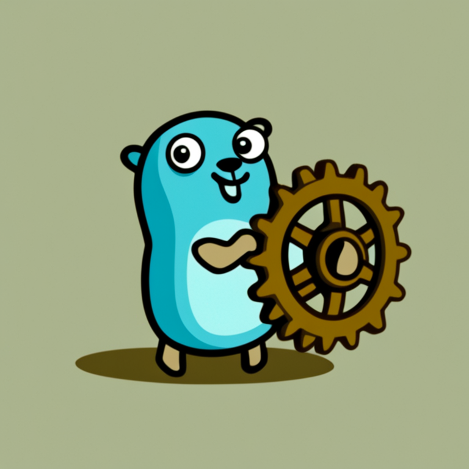

# Configurature

<p align="center">

</p>

Configurature is a Go library that provides declarative app configuration using structs.
Configuration values can be specified (in value precedence order) on the command line,
using environment variables, and/or in a config file (yaml or json).

Configuration structs can be composed in a way that your application's entry points do not
need to be aware of the structure of other packages' configurations in order to initialize them.

See the complete documentation at http://configurature.readthedocs.io.

## Basic Usage

Basic usage consists of defining your configuration structs and running `configurature.Configure()`.

```go
package main

import (
    "fmt"
    "net"
    "os"

    co "github.com/imoore76/configurature"
)

type AppConfig struct {
    ListenIP   net.IP `desc:"IP address on which to listen" default:"127.0.0.1"`
    ListenPort uint   `desc:"port on which to listen" default:"8080"`
}

func main() {

    conf := co.Configure[AppConfig](&co.Options{
        EnvPrefix: "APP_",
        Args:      os.Args[1:],
    })

    fmt.Printf("IP: %s\n", conf.ListenIP)
    fmt.Printf("Port: %d\n", conf.ListenPort)
}
```

Running this app with `--help` displays the app usage:

```
user@host $ myapp --help
Command usage:
  -h, --help               show help and exit
      --listen_ip ip       IP address on which to listen (default 127.0.0.1)
      --listen_port uint   port on which to listen (default 8080)
```

Configuration values can be specified on the command line, using environment variables, and/or in a config file.

Configurature also supports

* Custom types
* Validation
* Nested configurations

See the complete documentation at http://configurature.readthedocs.io.

## Contributing

See [`CONTRIBUTING.md`](CONTRIBUTING.md) for details.                           

## License 

Apache 2.0; see [`LICENSE`](LICENSE) for details.                      

## Disclaimer                                                                   

This project is not an official Google project. It is not supported by Google and Google specifically
disclaims all warranties as to its quality, merchantability, or fitness for a particular purpose.

